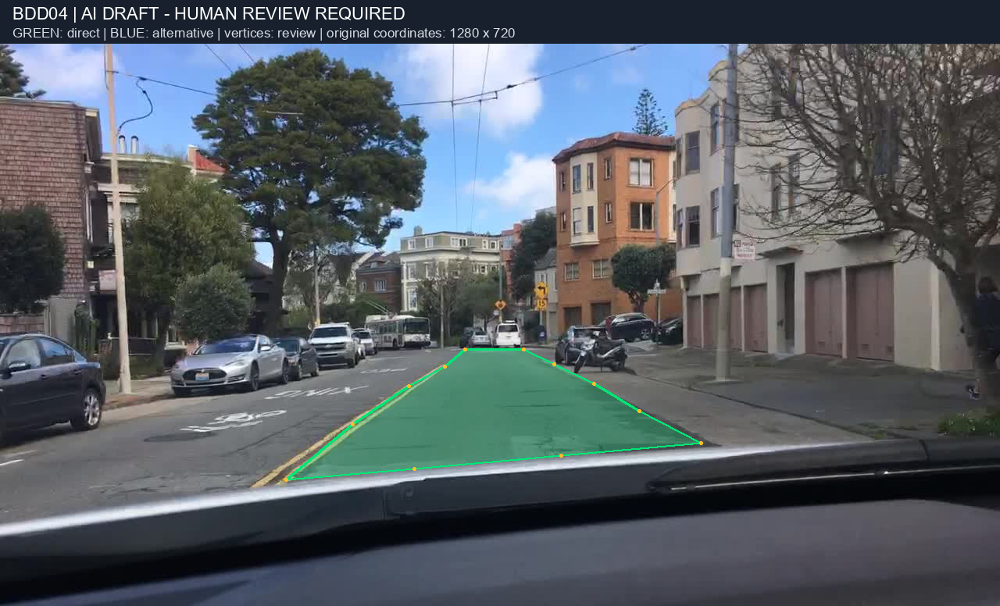
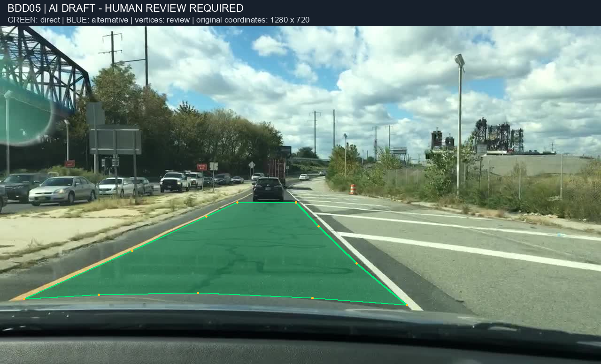
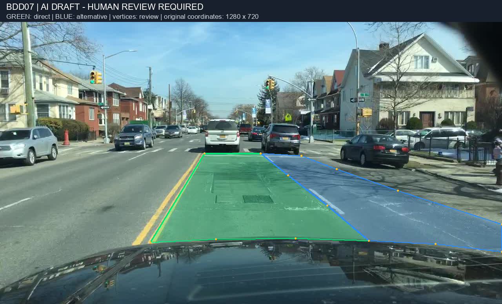
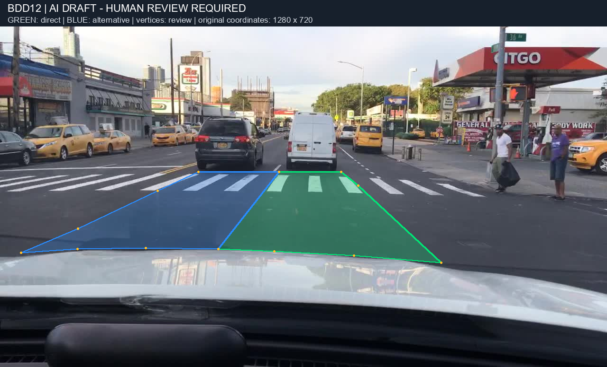
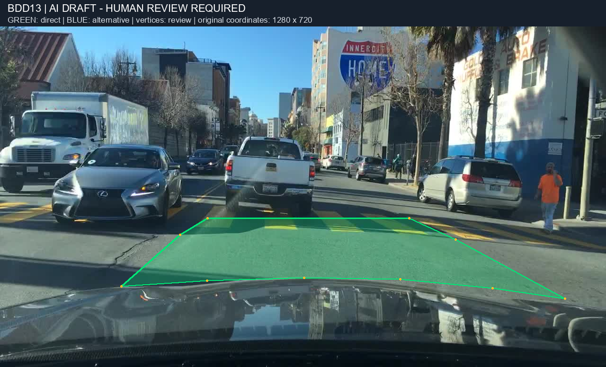
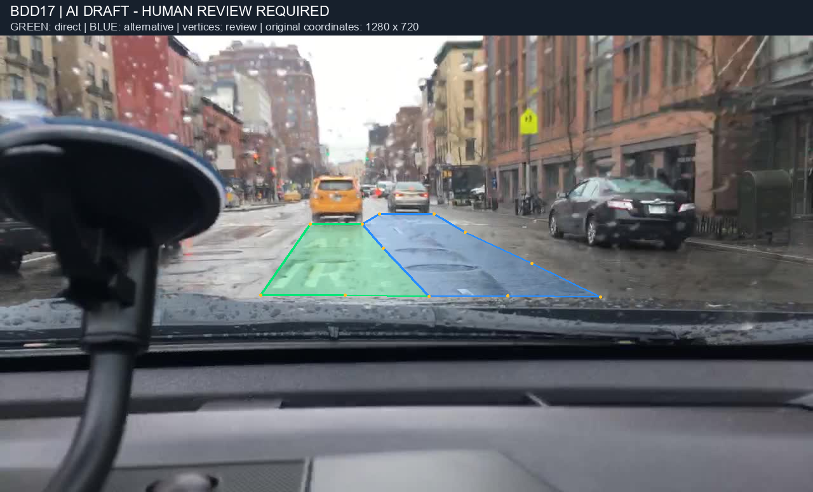
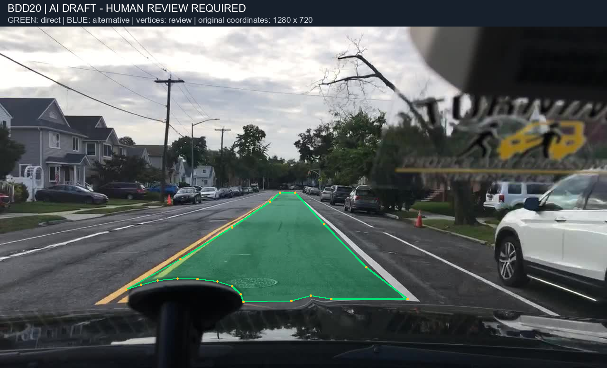
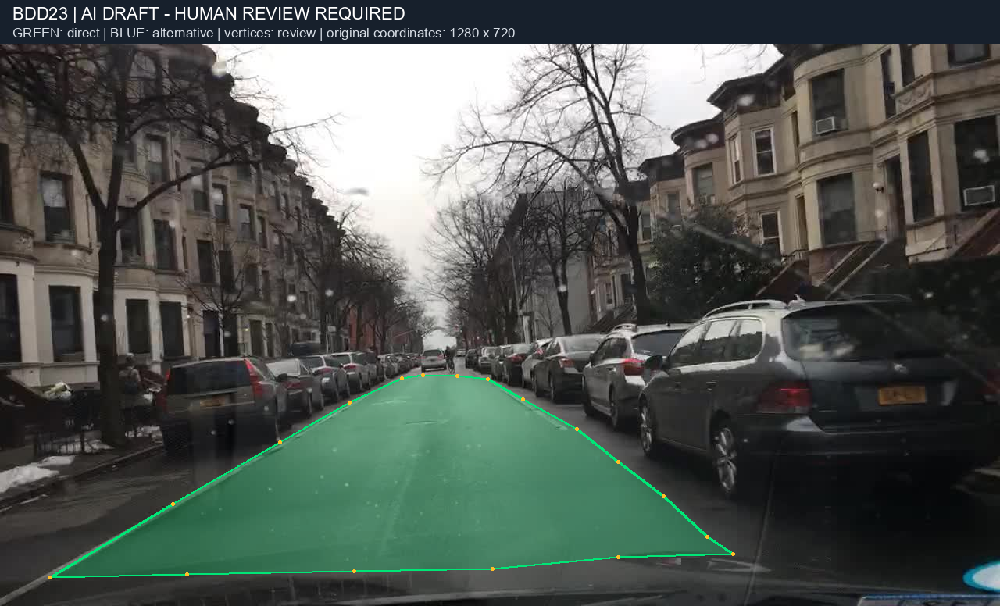

# Review bản nháp AI — Anh / sanaka

**Không phải calibration độc lập, không phải GT. Chưa được người duyệt.**

Xanh lá = direct; xanh dương = alternative. Mọi polygon có needs_review=true.
Ảnh gốc không bị sửa. Tọa độ XML/JSON dùng ảnh gốc 1280×720; thanh tiêu đề chỉ nằm trong ảnh preview.

## Kiểm tra từng ảnh

### BDD04

Kiểm tra biên phải nối hàng xe đỗ với curb; biên xa dừng bảo thủ. Không suy đoán alternative ở khoảng đỗ chưa rõ.

Escalation: Chưa xác nhận khoảng trống sát curb có đủ điều kiện parking alternative; chưa vẽ vùng nghi vấn.

- [ ] Đã kiểm tra boundary, direct/alternative, vật che và mui xe.
- [ ] Đã sửa/giải quyết needs_review và escalation trên CVAT.

### BDD05

Direct dừng ngang đáy xe đen; kiểm tra mép trong vạch vàng và vạch trắng sát gore. Không tô vùng gạch chéo.

Không có image_escalate; vẫn cần duyệt polygon.

- [ ] Đã kiểm tra boundary, direct/alternative, vật che và mui xe.
- [ ] Đã sửa/giải quyết needs_review và escalation trên CVAT.

### BDD07

Direct dừng sau minivan. Alternative bên phải dừng sau SUV; kiểm tra biên chia làn qua giao lộ và ranh vùng đỗ xe.

Không có image_escalate; vẫn cần duyệt polygon.

- [ ] Đã kiểm tra boundary, direct/alternative, vật che và mui xe.
- [ ] Đã sửa/giải quyết needs_review và escalation trên CVAT.

### BDD12

Direct dừng sau van trắng; alternative bên trái dừng sau SUV. Kiểm tra đường chia làn nội suy qua crosswalk; không tô lối vào cây xăng.

Escalation: Dải sát curb bên phải có thể là parking/buffer hoặc lane; chưa đủ chắc khả năng tiếp cận, chưa vẽ alternative ở đó.

- [ ] Đã kiểm tra boundary, direct/alternative, vật che và mui xe.
- [ ] Đã sửa/giải quyết needs_review và escalation trên CVAT.

### BDD13

Direct dừng sau pickup. Biên trái nội suy theo vạch vàng; biên phải theo hàng xe đỗ. Không tô vùng phía sau pickup.

Escalation: Bề rộng vùng bên phải pickup không chứng minh có lane cùng chiều riêng; chưa tạo alternative, cần xác nhận quy tắc biên parking tại đây.

- [ ] Đã kiểm tra boundary, direct/alternative, vật che và mui xe.
- [ ] Đã sửa/giải quyết needs_review và escalation trên CVAT.

### BDD17

Mưa làm mờ vạch. Direct trước taxi; alternative trước sedan phải dựa trên vạch trắng và xe cùng chiều. Kiểm tra lại semantic alternative, không dùng phản chiếu làm biên.

Escalation: Biên parking phía phải không rõ; chỉ vẽ phần chắc hơn của lane cạnh ego, bỏ vùng sát curb chưa xác định.

- [ ] Đã kiểm tra boundary, direct/alternative, vật che và mui xe.
- [ ] Đã sửa/giải quyết needs_review và escalation trên CVAT.

### BDD20

Loại dải xe đạp bên phải. Polygon lõm chừa giá đỡ dưới ảnh; kiểm tra biên xa và đường bao giá đỡ.

Không có image_escalate; vẫn cần duyệt polygon.

- [ ] Đã kiểm tra boundary, direct/alternative, vật che và mui xe.
- [ ] Đã sửa/giải quyết needs_review và escalation trên CVAT.

### BDD23

Một vùng direct giữa hai hàng xe đỗ, dừng trước xe/cyclist phía xa. Kiểm tra vùng tối bên phải và biên dưới sát mui xe; không vẽ khoảng parking thiếu bằng chứng.

Escalation: Không có vạch giữa đường rõ: cần xác nhận đây là một lane di chuyển hợp lệ, và biên giữa lane với parking ở vùng tối; polygon là giả thuyết cần review.

- [ ] Đã kiểm tra boundary, direct/alternative, vật che và mui xe.
- [ ] Đã sửa/giải quyết needs_review và escalation trên CVAT.

## Import / bàn giao

1. Tạo task mới với 8 ảnh gốc và toàn bộ project/03_cvat_labels.json; không import vào task calibration độc lập đang có.
2. Upload annotations, chọn CVAT for images 1.1, dùng anh-ai-draft-cvat.zip (bên trong có annotations.xml).
3. Review từng ảnh theo checklist, chỉnh polygon/attributes và Save.
4. Nếu export lại, ghi rõ AI-assisted; không thay thế anh.zip độc lập một cách âm thầm.

Đã kiểm tra offline: đủ 8 ảnh, polygon hợp lệ/không tự cắt, nằm trong ảnh, không overlap, enum hợp lệ và XML đọc được.
Chưa kiểm thử import trên CVAT đang chạy; chưa so GT hay đo IoU; kiểm tra hình học không chứng minh nhãn đúng.

## Nguồn và tái tạo

AI-assisted draft from original images and guideline v1; not independent human calibration or ground truth. All polygons require human review.

Không sử dụng export thành viên khác hoặc mask gold. Các quyết định vẫn có thể sai và cần người duyệt.

- SHA256 02_guideline.md: `161e046bcfd9dee10fcd5e3f6bcc172cb862d062da71d8b01b24ba7456d89e8f`
- SHA256 03_cvat_labels.json: `15cf7969e86c0b37e80f35d61d518a56a0bf129b93d5f3a4d575d5c72cdd5bbc`

Chạy lại build.py bằng Anaconda base sau khi sửa annotations.json.
