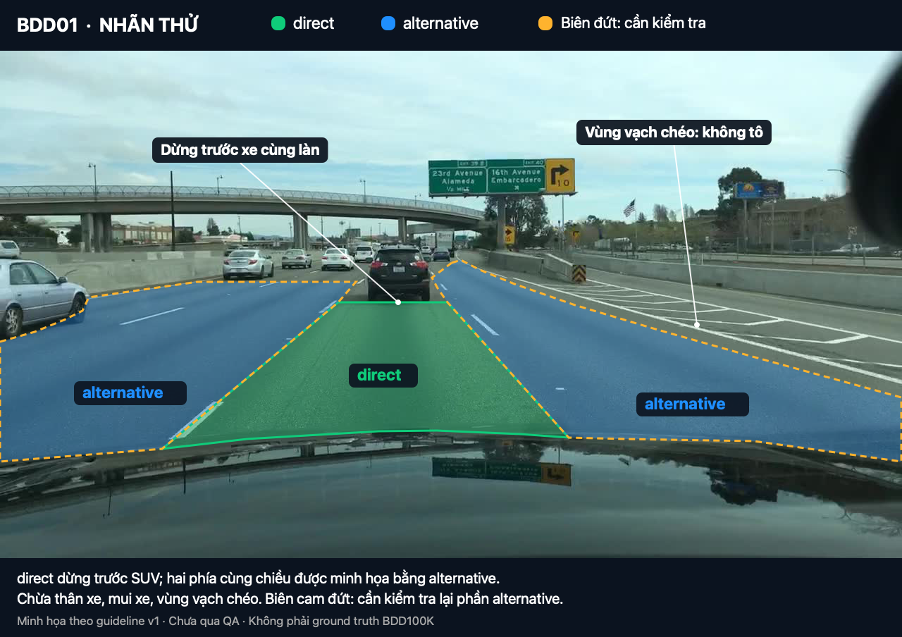
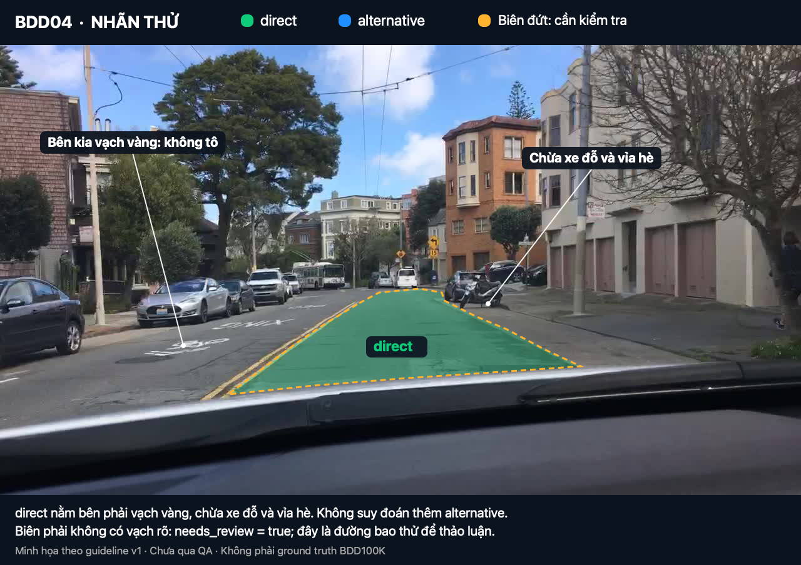
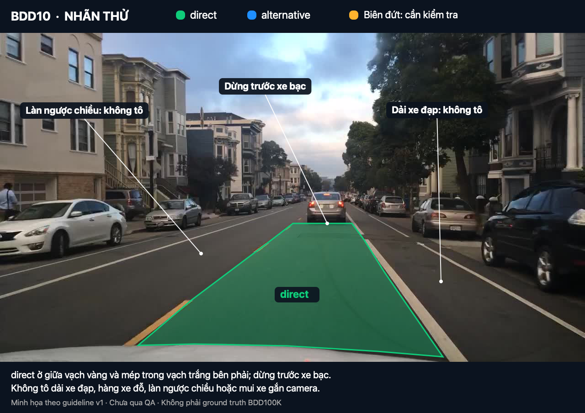
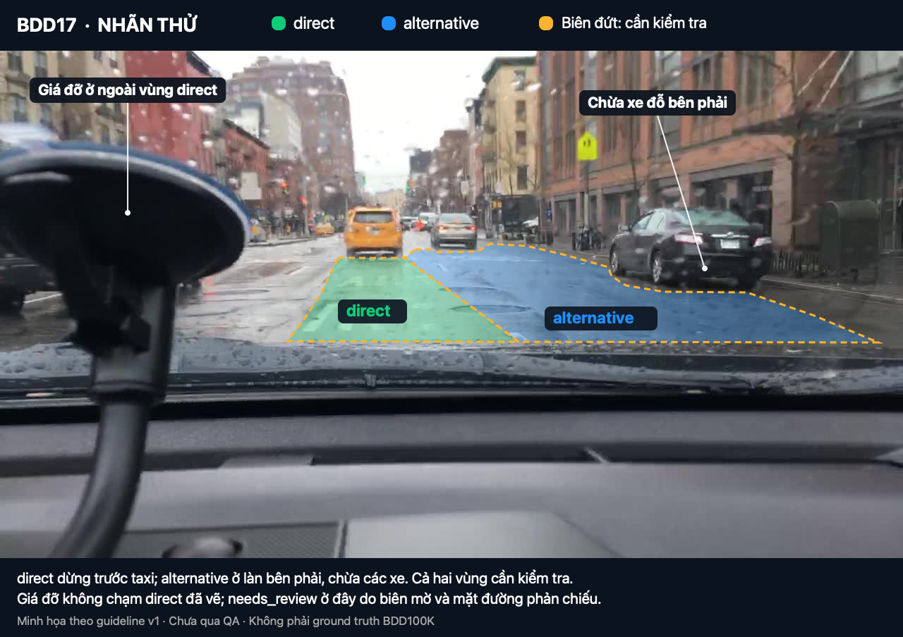

# Hướng dẫn khoanh vùng đường cho xe gắn camera — Drivable area

**Version:** v2

<!--
v0 = chưa có bản nháp. Đổi dòng Version ở trên thành v1 khi xong bản nháp đầu, v2 sau calibration, v3 sau blind
handoff; mỗi lần tăng version ghi một dòng vào 08_revision_log.md. `make freeze` đòi v2 trở lên.

File này là thứ nhóm peer nhận nguyên văn trong blind pack và là Guide dán vào CVAT. Peer KHÔNG nhận
edge_case_cards.md, gold_decisions.csv hay sample_pack.csv. Rule nào peer cần biết phải nằm ở đây.
No hidden rules: rule chỉ giải thích bằng miệng thì coi như không tồn tại.
Ví dụ trong guideline chỉ dùng ảnh split example hoặc calibration, không dùng ảnh blind.
-->

> **Cách dùng:** Đọc mục 1–4 để bắt đầu. Khi gặp ảnh khó, tra mục 5–7. Trước khi lưu, kiểm tra mục 10.
> Mọi quy tắc cần làm theo phải được ghi trong file này. Quy tắc chỉ được giải thích bằng miệng chưa được coi là
> quy tắc chung của nhóm.

## 1. Bạn cần làm gì? (Objective + scope)

Bạn xem từng ảnh chụp từ camera trên ô tô, rồi khoanh vùng mặt đường theo quy tắc của bài tập. Ô tô gắn camera
được gọi là **ego**. Kết quả giúp huấn luyện hệ thống hỗ trợ lái xe nhận biết làn đang đi và vùng đường khác có thể
đi vào.

Hãy tưởng tượng bạn ngồi trong xe gắn camera và nhìn về phía trước. Với mỗi vùng đường, hãy hỏi:
**"Đây là làn xe mình đang đi, vùng khác có thể đi vào, hay vùng phải bỏ ra?"**

| Từ bạn sẽ gặp | Hiểu đơn giản |
|---|---|
| `direct` | Phần đường thuộc làn xe gắn camera đang đi |
| `alternative` | Vùng đường khác có thể đi vào theo quy tắc của bài, ví dụ làn cùng chiều bên cạnh |
| background | Vùng không được khoanh trong bài này; không tạo nhãn riêng cho vùng đó |
| polygon | Hình kín tạo bằng cách bấm các điểm quanh mép vùng cần khoanh |
| thuộc tính (attribute) | Thông tin chọn thêm cho hình đã vẽ, ví dụ loại vùng và có cần kiểm tra lại hay không |

**Không phải chỗ nào có nhựa đường cũng được khoanh.** Hãy nhìn vạch sơn, chiều đi, vỉa hè, dải phân cách và vật
cản. Các quy tắc dưới đây là quy ước gán nhãn của bài tập; không dùng chúng thay cho hướng dẫn luật giao thông.

- **Cần vẽ:** `direct` — làn ego đang đi; `alternative` — vùng khác cùng chiều ego đi vào được
  hợp lệ (làn bên cạnh, nhánh rẽ trong giao lộ, đoạn trống của làn đỗ).
- **Không vẽ (background):** làn ngược chiều, lề cao tốc (shoulder), vùng vạch chéo (gore), làn xe
  đạp, vỉa hè, lối vào trạm xăng / bãi đỗ tư nhân, đoạn làn đỗ đang có xe, mui xe ego.
- Với ảnh đường phố Mỹ trong bài, dùng **vạch vàng giữa đường** làm dấu hiệu phân cách hai chiều;
  **vạch trắng đứt chia làn** làm dấu hiệu có thể chuyển giữa các làn cùng chiều. **Vạch trắng liền** có thể là
  biên làn hoặc biên đường: cần xem cả bối cảnh, không dựa riêng màu vạch để quyết định.
- Trường hợp làn cùng chiều bên kia vạch trắng liền là **trường hợp tạm cần kiểm tra**, làm theo mục 5 và 7;
  không coi nhãn tạm đó là xác nhận xe được phép chuyển làn.
- Bài này xác định vùng đường theo quy ước, không quyết định xe có được đi **ngay lúc này** hay không. Vì vậy,
  đèn đỏ hoặc vạch dừng không tự làm phần đường phía sau chúng biến thành background (xem mục 3.6).

## 2. Mỗi ảnh cần vẽ những gì? (Annotation unit)

- Đơn vị là **một ảnh tĩnh**. Mỗi ảnh xét độc lập.
- Bạn khoanh **vùng mặt đường**, không vẽ khung chữ nhật quanh ô tô và không chỉ kẻ một đường theo vạch sơn.
- `direct`: thường là **1 polygon**. Nếu vật che chia phần đường hợp lệ thành các mảnh rời nhau, mỗi mảnh nhìn thấy
  được vẽ thành một polygon `direct` riêng; không nối xuyên qua vật che. Quy tắc dừng trước xe cùng làn ở mục 3.5
  vẫn áp dụng: không thêm polygon `direct` phía sau xe đó.
- Không có làn ego nhìn thấy (ví dụ mui xe che hết) → không vẽ `direct`, gắn tag `image_escalate` và ghi lý do.
- `alternative`: **mỗi vùng rời nhau là một polygon riêng** (làn trái, làn phải, nhánh rẽ…). Hai làn cùng chiều liền
  nhau, không có gì ngăn giữa, được vẽ chung một polygon `alternative`.

## 3. Vẽ trong CVAT và đặt đường bao ở đâu? (Geometry rule)

### Làm một ảnh theo 6 bước

1. **Quan sát cả ảnh:** tìm làn xe gắn camera đang đi, xe phía trước, vạch chia chiều và vùng bị che.
2. **Chọn công cụ:** chọn **Draw new polygon**, nhãn `drivable_area`, rồi **Shape**. Không dùng **Track** vì đây
   là ảnh tĩnh.
3. **Vẽ vùng `direct` trước:** bấm các điểm quanh mép vùng đường, ít nhất 3 điểm, rồi bấm **Done** hoặc **N** để
   kết thúc. Đoạn thẳng chỉ cần các điểm cần thiết; thêm điểm khi đường bao đổi hướng.
4. **Chọn loại vùng:** trong **Objects**, mở hình vừa vẽ và chọn `area_type = direct`. Vẽ các vùng còn lại rồi
   chọn `area_type = alternative` cho từng hình tương ứng. Không để `__undefined__`.
5. **Sửa đường bao:** phóng to chỗ khó; trong **Appearance**, giảm **Opacity** (độ đậm của lớp màu) để nhìn được
   vạch sơn bên dưới. Kéo điểm hoặc cạnh để chỉnh, không để các hình đè lên nhau.
6. **Kiểm tra và lưu:** nếu không chắc, xử lý theo mục 7; kiểm checklist mục 10 rồi bấm **Save**.

### Quy tắc đặt đường bao (các quy tắc 3.1–3.9)

1. Công cụ: **Polygon**. Vẽ `direct` trước, `alternative` sau.
2. **Biên ngoài** vùng được vẽ bám **mép trong của vạch sơn**: lấy cạnh vạch sát phần đường cần khoanh, không lấy
   cả vạch. Nếu không có vạch, bám **chân vỉa hè** — chỗ mặt đường tiếp xúc với vỉa hè.
3. **Ngoại lệ cho biên chung:** giữa `direct` và `alternative`, đường bao đi qua **giữa vạch trắng đứt chia làn**.
   Nối theo hướng của vạch qua các đoạn đứt. Hai polygon chạm nhau tại đường này, không chồng lên nhau.
4. Mép dưới polygon dừng ở **mép mui xe ego**, không tràn lên mui hay phản chiếu trên mui.
5. **Xe khác:** `direct` dừng ở mép dưới (bánh sau / cản sau) của xe phía trước cùng làn — không đoán phần đường sau
   xe. Xe nằm ở làn bên thì cắt phần thân xe khỏi polygon `alternative`.
6. **Giao lộ (nơi các đường gặp nhau):** khi làn ego cho phép đi thẳng và nhìn rõ làn tương ứng bên kia, kéo
   `direct` qua vạch dừng và **vạch sang đường cho người đi bộ (crosswalk)**. Đoạn không có vạch trong lòng giao lộ
   được nối thẳng giữa hai đầu mép làn đã xác định. Đây là cách nối biên trên mặt đường nhìn thấy, không phải
   cho phép đoán đường phía sau xe hoặc vật che. Nhánh đường ego có thể rẽ vào hợp lệ → `alternative`.
   Nếu làn ego chỉ cho rẽ, không có đường đi thẳng, hoặc không xác định được làn nối tiếp, không tự kéo thẳng:
   giữ phần chắc chắn và gắn `image_escalate`, ghi rõ lý do để nhóm kiểm tra.
7. Không kéo polygon vào vùng **không nhìn thấy** (tối hẳn, bị che, quá xa). Dừng ở chỗ cuối cùng còn thấy được mép
   đường.
8. Các cạnh polygon không được tự cắt chéo. Vùng rời nhau → nhiều polygon. Nếu vật cản nằm trọn bên trong vùng,
   có thể chia phần đường quanh nó thành các polygon đơn giản, chạm mép nhưng không chồng nhau, để chừa vật cản
   ra ngoài. Không tạo đường bao tự cắt để giả một hình có lỗ. Nếu cần công cụ tô từng điểm ảnh (**mask**) để làm
   chính xác, gắn `image_escalate` và ghi lý do; nhóm phải thống nhất cách làm trước khi đổi công cụ.
9. **Sai lệch đường bao cho phép:** trên ảnh gốc cao 720 pixel, tối đa 10 pixel ở nửa dưới (từ hàng y = 360),
   20 pixel ở nửa trên; đoạn nối trong giao lộ tối đa 30 pixel so với đường nối quy định ở mục 3.6. Pixel là một
   điểm ảnh; y được tính từ mép trên xuống. Đo trên ảnh gốc, không trên kích thước đang phóng to của màn hình.
   Nếu ảnh có kích thước khác, báo người phụ trách để chốt ngưỡng trước khi chấm.

## 4. Chọn nhãn và thông tin đi kèm (Taxonomy)

Mọi vùng đường đều dùng nhãn **`drivable_area`**. Để phân biệt hai loại vùng, chọn thuộc tính **`area_type`**.
Không tạo thêm hai nhãn riêng tên `direct` và `alternative`.

Ví dụ một vùng chắc chắn thuộc làn đang đi: `drivable_area` → `area_type = direct` → `needs_review = false`.
`true` nghĩa là bật/đánh dấu; `false` nghĩa là tắt/không đánh dấu.

| Tên | Loại CVAT | Nhãn / thuộc tính | Giá trị | Mặc định | Ghi chú |
|---|---|---|---|---|---|
| `drivable_area` | polygon | class | — | — | vùng ego đi được |
| `area_type` | select | attribute của `drivable_area` | `__undefined__`, `direct`, `alternative` | `__undefined__` | bắt buộc chọn; `__undefined__` còn trong export = chưa gán, tính là lỗi |
| `needs_review` | checkbox | attribute của `drivable_area` | `false` / `true` | `false` | bật khi biên hoặc loại vùng không chắc (mục 7) |
| `image_escalate` | tag (cả ảnh) | class | — | — | có vấn đề chưa quyết được an toàn trên ảnh; ghi rõ vùng có vấn đề (mục 7) |
| `reason` | text | attribute của `image_escalate` | chữ tự do | trống | bắt buộc ghi lý do ngắn |

Background không có label: **không vẽ polygon background**. Tuy nhiên, vùng để trống vì không đủ bằng chứng phải
đi kèm `image_escalate` và lý do, để người kiểm tra phân biệt với vùng đã xác định là background.

Trong slide tham khảo, thuộc tính được viết là `areaType`; **bài này thống nhất dùng `area_type`**. Người setup
phải cấu hình `03_ontology_and_cvat_setup.md`, `03_cvat_labels.json` và task CVAT khớp bảng trên. Nếu mở task mà
thiếu tên nhãn hoặc thuộc tính này, báo người setup; không tự chọn một nhãn gần giống để thay thế.

## 5. Tình huống nào vẽ, tình huống nào bỏ ra? (Inclusion / exclusion)

| Tình huống | Quyết định |
|---|---|
| Làn ego đang chạy | `direct` |
| Làn cùng chiều bên cạnh, ngăn bằng vạch trắng đứt | `alternative` |
| Làn đã xác định cùng chiều, ngăn bằng vạch trắng liền nhưng chưa rõ quyền đi vào | Tạm vẽ `alternative` + `needs_review = true` để người phụ trách quyết định; chưa coi là nhãn đã duyệt |
| Làn có bằng chứng rõ xe ego không được đi vào, ví dụ biển cấm áp dụng cho ego | background; quy tắc này ưu tiên hơn trường hợp chưa rõ ở dòng trên |
| Giao lộ phía trước, hướng đi thẳng | `direct` (kéo qua, mục 3.6) |
| Nhánh đường ngang ego rẽ vào đúng chiều | `alternative` |
| Làn rẽ riêng hoặc làn nhập vào dòng xe (merge), ego chưa ở trong làn đó | `alternative` nếu thấy rõ cùng chiều và có thể tiếp cận hợp lệ; không kéo qua đảo giao thông hoặc vùng vạch chéo |
| Vùng chờ trước giao lộ (waiting zone) | Nếu thuộc phần làn ô tô đang xét, gán cùng loại với làn đó; nếu dành riêng cho xe đạp/người đi bộ thì background. Không rõ dành cho ai → không vẽ vùng nghi ngờ, gắn `image_escalate` và ghi lý do |
| Làn đỗ xe — đoạn **trống** dài ≥ 1 thân xe | `alternative` |
| Làn đỗ xe — đoạn có xe đỗ, hoặc khe trống ngắn hơn 1 thân xe | background |
| Làn đỗ **không có vạch**: biên trong của làn đỗ = đường nối mép trong các xe đang đỗ | `direct` dừng ở đường đó |
| Lề cao tốc (shoulder) ngoài vạch biên liền | background |
| Vùng vạch chéo (gore) và làn chỉ vào được khi cắt qua gore | background |
| Làn ngược chiều (bên kia vạch vàng, dải phân cách) | background — **tô vào là lỗi critical** |
| Làn xe đạp (có ký hiệu xe đạp / dải hẹp giữa hai vạch trắng liền, xe đỗ nằm ngoài dải) | background |
| Vỉa hè, dải cỏ, đảo giao thông, dải phân cách, lối vào trạm xăng / bãi đỗ tư nhân | background |
| Đống tuyết, rào chắn, vật cản cố định lấn vào làn | cắt khỏi polygon (background) |

**Làn đỗ hay làn xe đạp?** Làn đỗ là dải mà xe **đang đỗ bên trong** nó. Dải hẹp nằm giữa làn chạy và hàng xe đỗ,
không có xe nào đỗ trong dải, là làn xe đạp / vùng đệm → background.

**Khoảng trống dài một thân xe:** ước lượng theo chiều dài ô tô gần đó ở cùng khoảng cách trong ảnh; không lấy
số pixel của xe ở gần để so trực tiếp với khoảng trống ở xa. Nếu đã rõ là làn đỗ nhưng không chắc khoảng trống
đủ dài, vẽ theo phán đoán tốt nhất và bật `needs_review`.

## 6. Bị che, quá tối hoặc quá xa thì làm gì? (Visibility / occlusion)

- **Xe che mặt đường:** chỉ vẽ phần mặt đường nhìn thấy; không nối polygon ra sau xe (mục 3.5).
- **Giá đỡ điện thoại, sticker, gạt nước che ảnh:** cắt vùng bị che khỏi polygon. Nếu vùng bị che làm mất biên làn ego
  → bật `needs_review` trên polygon bị ảnh hưởng.
- **Đêm, mưa, loá:** vẽ tới chỗ còn phân biệt được vạch hoặc mép đường. Mặt đường ướt phản chiếu đèn không phải lý do
  kéo dài polygon.
- **Xa, nhỏ:** khi hai mép làn chụm lại chỉ còn vài pixel, dừng polygon ở chỗ còn tách được mép (không vẽ tới điểm
  tụ).
- **Mép ảnh:** vùng đi được bị cắt bởi mép ảnh thì polygon chạy theo mép ảnh.

Không có ngưỡng diện tích tối thiểu để tự động bỏ một vùng. Với vùng nhỏ, hãy phóng to để kiểm tra; chỉ vẽ khi
còn phân biệt được mép và loại vùng. Nếu không đủ bằng chứng, dùng mục 7 thay vì tự đoán.

## 7. Không chắc thì chọn cách nào? (Ambiguity / escalation)

Đọc bảng từ trên xuống. Trường hợp có nguy cơ tô nhầm làn ngược chiều luôn ưu tiên cách **ESCALATE** bên dưới.

| Quyết định | Khi nào | Thể hiện trong CVAT |
|---|---|---|
| **LABEL — vẽ và chọn loại** | Nhìn thấy rõ vùng và biết loại | polygon `drivable_area`, `area_type` = `direct` / `alternative`, `needs_review = false` |
| **IGNORE — không vẽ vùng này** | Vùng thuộc background (mục 5) | không vẽ polygon ở vùng đó |
| **UNKNOWN — vẽ tạm, cần kiểm tra** | Biết vùng đi được nhưng không chắc biên hoặc không chắc `direct` hay `alternative`; hoặc trường hợp vẽ tạm được nêu rõ ở mục 5 | vẫn vẽ polygon theo phán đoán tốt nhất + `needs_review = true` |
| **ESCALATE — nhờ người phụ trách quyết định** | Không xác định được làn ego, không rõ chiều đi hoặc quyền sử dụng vùng đường, ảnh gần như tối hẳn, hoặc quy tắc chưa đủ để xử lý | Không vẽ vùng đang nghi ngờ; thêm tag `image_escalate`, ghi `reason` ngắn; vẫn vẽ những vùng chắc chắn |

Riêng làn **đã rõ cùng chiều** bên kia vạch trắng liền nhưng chưa rõ quyền đi vào, dùng cách vẽ tạm ở mục 5.
Ngoại lệ này không áp dụng khi chưa rõ chiều đi hoặc đã thấy bằng chứng cấm ego đi vào.

- Không đoán chiều đi của một làn. Nếu các dấu hiệu như vạch phân chia, mũi tên và hướng xe chưa đủ để xác định
  chiều đi → không vẽ vùng nghi ngờ, gắn `image_escalate` và ghi lý do. Không dùng `needs_review` để hợp thức hóa
  một phỏng đoán về chiều đi.
- Nghi ngờ giữa `alternative` và background ở vùng có thể là làn ngược chiều → **không vẽ** + `image_escalate`. Bỏ sót
  một làn đi được ít nguy hiểm hơn tô nhầm làn ngược chiều.
- Mọi `needs_review` và `image_escalate` được người phụ trách chất lượng (QA owner) xem lại; kết luận được ghi
  thành quy tắc ở phiên bản sau.

**Thao tác cụ thể:**

- Cần kiểm tra một polygon: mở hình đó trong **Objects**, bật `needs_review`.
- Cần nhờ quyết định trên ảnh: chọn **Setup tag** → `image_escalate` → **Tag**, rồi điền `reason`, ví dụ
  “Không rõ chiều đi của làn bên trái” hoặc “Làn ego chỉ cho rẽ, chưa rõ đường bao qua giao lộ”.
- `UNKNOWN` là tên cách xử lý, **không phải một giá trị để chọn trong `area_type`**. Vẫn chọn `direct` hoặc
  `alternative` theo phán đoán tốt nhất và bật `needs_review` khi đủ điều kiện trong bảng.
- `__undefined__` nghĩa là **chưa chọn**, không có nghĩa là “không biết”. Không dùng nó thay cho báo cần kiểm tra.
- `IGNORE` được thể hiện bằng việc không có polygon tại vùng background; không có nút hoặc nhãn `IGNORE` riêng.
  Một ảnh trống do không nhìn rõ phải có tag và lý do, không được trông giống ảnh đã kiểm tra xong và không có vùng
  phù hợp.

### Bổ sung sau calibration nội bộ — v2

- **Gore không phải alternative:** một vùng chỉ tiếp cận được bằng cách cắt qua vùng vạch chéo vẫn là background; không vẽ polygon trên gore hoặc phần đường bị gore cô lập. BDD05 là ví dụ calibration cho rule này.
- **Không suy ra lane từ khoảng asphalt rộng:** chỉ tạo `alternative` khi có bằng chứng về một vùng/làn cùng chiều và có thể tiếp cận. Curb lane, driveway, khoảng sát trạm xăng hoặc vùng cạnh hàng xe đỗ không tự động là alternative. BDD12 và BDD23 là các ví dụ calibration.
- **Dải ngoài vạch trắng cạnh hàng xe đỗ:** nếu là dải hẹp và xe đỗ nằm ngoài dải thì đó là bike lane/buffer → background. Không biến toàn bộ dải này thành parking alternative. BDD20 là ví dụ calibration.
- **Ranh xe phía trước quan trọng hơn việc tô kín:** `direct` dừng ở cản/bánh sau của xe cùng làn; không kéo tới horizon hoặc nối quanh xe để làm polygon lớn hơn. Với alternative có xe chiếm chỗ thì chừa footprint xe và chỉ vẽ phần nhìn thấy có bằng chứng.
- Các khác biệt về biên không được giải quyết chỉ bằng IoU. Reviewer kiểm riêng lỗi lấn làn ngược chiều/gore/sidewalk/vật cản và semantic `area_type`.

## 8. Có cần theo dõi qua nhiều ảnh không? (Temporal rule)

**Không dùng cho bài này.** Đây là các ảnh đứng yên, không phải bài theo dõi xe trong video. Xét từng ảnh độc lập,
dùng **Shape**, không dùng **Track** và không lấy ảnh trước/sau để đoán vùng bị che trong ảnh đang làm.

## 9. Ví dụ và cách luyện tập (Examples)

### Ví dụ theo mã ảnh

Các ảnh dưới đây đã được **khoanh thử trên ảnh gốc** để bạn dễ hình dung. Đây là bản minh họa theo guideline v1,
**đã được nhóm review cho mục đích guideline nhưng không phải đáp án chuẩn của BDD100K**. Biên đang cần kiểm tra có thể
được chỉnh lại sau lượt làm thử; không dùng các ảnh này để chấm độ chính xác theo pixel.

**Cách đọc màu:** xanh lá = `direct`; xanh dương = `alternative`; đường viền cam đứt = `needs_review = true`
trên polygon đó. Các vùng background không được tô. Màu chỉ giúp đọc hình, không phải tên nhãn mới trong CVAT.
Chọn “Mở ảnh lớn” để xem rõ đường bao và chú thích.

| Mã ảnh | Ảnh đã khoanh thử | Cách đọc và điểm cần chú ý |
|---|---|---|
| **BDD01** |    [Mở ảnh lớn](assets/examples/BDD01-annotated.png) | **Cao tốc nhiều làn.** `direct` dừng trước SUV đen; `alternative` minh họa phần đường cùng chiều hai bên. Không tô thân xe, mui xe, vùng vạch chéo hoặc làn phía bên kia vùng đó. **Cần kiểm tra:** phần `alternative` phía xa và biên sát vùng vạch chéo; bản thử dừng bảo thủ ở phần nhìn rõ, chưa xác nhận đã khoanh đủ mọi vùng xa. **Quy tắc:** 3.5, 3.7, 5. |
| **BDD04** |    [Mở ảnh lớn](assets/examples/BDD04-annotated.png) | **Phố hai chiều, có xe đỗ.** `direct` nằm bên phải vạch vàng; chừa xe đỗ và vỉa hè. Bên trái vạch vàng là background. **Cần kiểm tra:** biên phải ở chỗ chuyển từ vỉa hè sang hàng xe đỗ không có vạch, nên polygon bật `needs_review`. Không tự suy đoán thêm vùng `alternative` khi chưa đủ bằng chứng. **Quy tắc:** 3.2, 5, 7. |
| **BDD10** |    [Mở ảnh lớn](assets/examples/BDD10-annotated.png) | **Dải xe đạp cạnh hàng xe đỗ.** `direct` nằm giữa vạch vàng và mép trong vạch trắng bên phải, dừng trước xe bạc. Dải hẹp bên phải, hàng xe đỗ, làn ngược chiều và mui xe đều không tô. Không có `alternative` trong bản thử này. **Quy tắc:** 3.2, 3.4, 3.5, 5. |
| **BDD17** |    [Mở ảnh lớn](assets/examples/BDD17-annotated.png) | **Mưa, đường phản chiếu, có giá đỡ điện thoại.** `direct` dừng trước taxi; `alternative` ở làn cùng chiều bên phải và chừa các xe. **Cần kiểm tra:** biên mờ nên cả hai polygon bật `needs_review`. Trong cách khoanh này, giá đỡ nằm bên trái và **không chạm `direct`**; không tạo thêm chỗ cắt ở một vùng không giao nhau. **Quy tắc:** 3.5, 6, 7. |

Tọa độ polygon và lý do cần kiểm tra được lưu trong [annotations.json](assets/examples/annotations.json), tính
trên ảnh gốc 1280 × 720. Phần tiêu đề và chú thích của ảnh minh họa nằm ngoài tọa độ này. Ảnh gốc không bị sửa.
Khi chép guideline sang CVAT hoặc gửi riêng file Markdown, cần đính kèm các ảnh trong `assets/examples/`;
đường dẫn tương đối trong bảng không tự tải ảnh từ máy bạn lên CVAT. Người setup phải kiểm tra cả bốn ảnh hiển thị
được trong Guide trước khi bàn giao.

### Chuẩn bị ảnh luyện tập — dành cho người tổ chức

- Dùng ảnh BDD100K đã có trong `data/bdd100k/`. Chọn đủ tình huống: đường bình thường, giao lộ/nhập làn,
  đảo giao thông/dải phân cách, xe đỗ/vật che, đêm/mưa nếu dữ liệu có.
- Slide tham khảo gợi ý 12–15 ảnh luyện tập, gồm ít nhất 4 ảnh giao lộ/nhập làn, 2 ảnh có đảo/dải phân cách,
  2 ảnh có xe đỗ/vật che và 2 ảnh đêm/mưa nếu có. Đây là gợi ý độ đa dạng, không phải yêu cầu phải tải thêm ảnh.
- Bài challenge này chia riêng **3–5 ảnh example**, **5–8 ảnh calibration** (để các bạn làm độc lập rồi so sánh),
  **4–5 ảnh blind** (để nhóm khác làm mà chưa biết đáp án), theo README. Ghi phân chia vào `sample_pack.csv`.
  Các ảnh đã mô tả trong guideline, gồm BDD01, BDD04, BDD10 và BDD17, chỉ được xếp vào example hoặc calibration.
- Không đưa ảnh hoặc đáp án blind vào phần minh họa. Không dựa vào file riêng hoặc lời giải thích miệng để bổ sung
  một quy tắc mà người nhận guideline cần biết.

### So với đáp án tham khảo

**Ground truth (GT)** là nhãn tham khảo dùng để so sánh. **Mask** là bản tô nhãn theo từng điểm ảnh. Nếu có mask
BDD100K đúng của ảnh đang làm, có thể chồng nó với vùng đã vẽ và giảm độ đậm để nhìn chỗ lệch. Không coi phần mô tả
ví dụ bên trên là mask GT, và không giả định thư mục ảnh đã có sẵn mask.

Polygon và mask có cách biểu diễn khác nhau nên không đòi hỏi từng pixel trùng tuyệt đối. Nếu quy ước lớp học khác
nhãn gốc BDD100K, ghi lại khác biệt và đánh giá theo guideline đã thống nhất. Không tự đổi quy tắc chỉ để tăng điểm.

| Cách kiểm tra được gợi ý trong slide | Hiểu đơn giản |
|---|---|
| Mask/region IoU | Diện tích giao nhau chia cho diện tích hợp của vùng dự đoán và GT; càng gần 1 càng trùng khớp |
| Boundary error / kiểm tra đường bao | Xem đường bao có lấn lên vỉa hè, đảo giao thông hoặc sai ở vạch sang đường không, dù IoU tổng thể cao |
| Direct-vs-alternative accuracy | Kiểm tra vùng đã vẽ có bị chọn nhầm `direct` và `alternative` không |
| Critical boundary error count | Đếm riêng lỗi nghiêm trọng, ví dụ tô sang làn ngược chiều; không để điểm trung bình cao che mất lỗi này |

Đây là các phép kiểm tra được đề xuất cho luyện tập, chưa phải kết quả đo hoặc ngưỡng đạt. Người tổ chức chốt
cách đo, ngưỡng và người kiểm tra trong `05_qa_plan.md`; thang điểm bàn giao của lab vẫn theo README.

### Nguồn tham khảo được nêu trong slide

Các đường dẫn này giúp người tổ chức tìm hiểu thêm; người gán nhãn không cần mở chúng để hiểu quy tắc của bài.

- [Định dạng dữ liệu BDD100K](https://github.com/bdd100k/bdd100k/blob/master/doc/source/format.rst).
- [Bài báo BDD100K](https://openaccess.thecvf.com/content_CVPR_2020/papers/Yu_BDD100K_A_Diverse_Driving_Dataset_for_Heterogeneous_Multitask_Learning_CVPR_2020_paper.pdf).
- [Cổng dữ liệu BDD100K](https://bdd-data.berkeley.edu/): slide giới thiệu bộ 100K Images cùng Drivable Area
  annotations. Slide cũng nêu bản mirror FiftyOne `dgural/bdd100k` và cách giới hạn số ảnh bằng `max_samples`.
  Với challenge hiện tại, tiếp tục dùng ảnh có sẵn trong repo theo README.
- [CVAT Academy — Polygon và Polyline](https://www.cvat.ai/academy/polygon-and-polyline-annotation).
- [CVAT Docs — Shapes](https://docs.cvat.ai/docs/annotation/manual-annotation/shapes/).

## 10. Lỗi thường gặp và kiểm tra trước khi lưu (Common mistakes)

1. **Tô hết nhựa đường** — gộp cả lề, vùng vạch chéo, làn đỗ có xe vào vùng đi được. Kiểm tra từng vùng theo mục 5.
2. **Tô qua vạch vàng** sang làn ngược chiều — lỗi critical. Kiểm lại mọi polygon nằm sát vạch vàng.
3. **Gộp các vùng `alternative` rời nhau** thành một polygon cho "đẹp" — mỗi vùng rời một polygon.
4. **Kéo `direct` xuyên qua xe phía trước** tới phần đường phía xa.
5. **Quên chọn `area_type`** — còn `__undefined__` trong export. Duyệt lại từng polygon trước khi export.
6. **Dừng `direct` chỉ vì gặp vạch dừng** — nếu đủ điều kiện đi thẳng và thấy rõ làn nối tiếp, kéo qua theo mục 3.6.
7. **Nhầm làn xe đạp với làn đỗ** trống — xem đoạn "Làn đỗ hay làn xe đạp?" ở mục 5.
8. **Polygon tràn lên mui xe ego** hoặc vẽ theo phản chiếu trên mặt đường ướt.
9. **Để trống thay vì escalate** — ảnh khó thì gắn `needs_review` / `image_escalate`, không bỏ qua im lặng.

### Tự kiểm tra từng ảnh

- [ ] Đã vẽ phần làn đang đi và các vùng `alternative` nhìn thấy, thuộc phạm vi bài.
- [ ] Không lấn lên vỉa hè, đảo giao thông, dải phân cách, mui xe hoặc thân xe khác.
- [ ] Không tô nhầm làn ngược chiều, làn xe đạp, lề cao tốc hoặc vùng vạch chéo.
- [ ] Không nối qua vật che, kéo quá xa hoặc để các polygon chồng lên nhau/tự cắt.
- [ ] Mọi polygon đã chọn `area_type`; không còn `__undefined__`.
- [ ] Chỗ chưa chắc đã có `needs_review` hoặc `image_escalate` đúng trường hợp; tag có `reason` rõ ràng.
- [ ] Đã bấm **Save**.

### Nhờ một bạn khác kiểm tra

Trong buổi luyện tập, người kiểm tra ưu tiên tìm 3 lỗi: **tô lấn vỉa hè/đảo giao thông**, **bỏ sót làn rẽ hoặc
vùng `alternative` hợp lệ**, **kéo polygon tới vùng không còn nhìn thấy**. Sau đó kiểm tra loại vùng và các dấu
báo cần xem lại. Nếu hai bạn hiểu quy tắc khác nhau, ghi lại mã ảnh và câu gây hiểu nhầm để nhóm sửa trong file;
không chỉ thống nhất miệng. Trong lượt blind, làm độc lập và ghi câu hỏi theo quy trình của lab.
